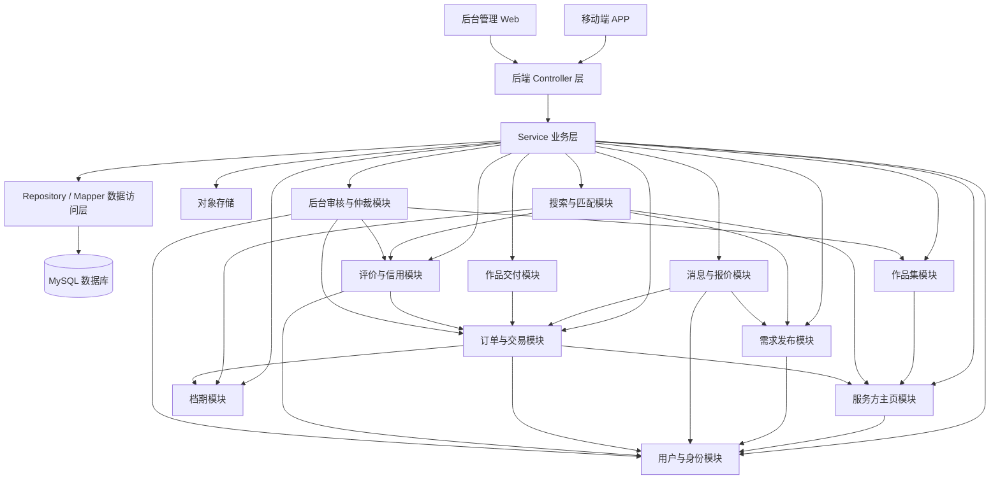

# 约拍服务平台 — 体系结构设计文档

**项目名称：** 约拍服务平台（SnapMatch）  
**文档版本：** v1.0  
**编写日期：** 2026年5月  
**团队规模：** 4人  
**开发周期：** 10周

---

## 一、架构概览

### 1.1 架构风格选择

本项目最终采用 **MVC + 分层架构** 为主体，内部按业务领域采用 **模块化单体（Modular Monolith）** 组织代码，并在关键业务节点引入 **轻量事件驱动** 作为解耦补充。

选择依据来源于团队"架构辩论赛"的集体决策：四位成员分别以不同 Prompt 策略咨询 AI 后，经过30分钟的线上辩论，一致投票选定该方案。核心理由如下：

1. **工程可控性**：MVC 框架（Spring Boot）天然提供路由、参数绑定、异常处理等基础能力，团队无需重复造轮子。分层架构确保 Controller 只处理请求、Service 承载业务逻辑、Repository 负责数据持久化，职责清晰。
2. **业务承载力**：约拍平台并非简单 CRUD，涉及复杂的订单状态机流转（沟通→报价→支付→拍摄→交付→评价）、档期冲突校验、双向信用评价体系。严格分层后，这些逻辑集中在 Service/Domain 层，不会散落四处。
3. **并行开发效率**：4人团队按业务模块拆分（用户、订单、档期、评价等），互不干扰。单体应用避免了微服务之间繁琐的网络通信与联调成本。
4. **可进化性**：模块化单体让代码结构在思想上接近微服务，未来可按现有模块边界进行平滑拆分。
5. **事件解耦**：订单完成后的通知推送、评价开启、信用分变动等"副作用"统一通过 Spring Event 触发，避免核心主流程代码臃肿。

### 1.2 不选其他方案的理由

- **纯 MVC（不选）：** 所有业务逻辑堆积在 Controller 层，订单流转、档期校验等复杂逻辑会迅速失控，到项目中后期 Controller 膨胀至数千行，难以维护和测试。
- **纯分层架构（不单独选）：** 分层只是一种结构思想，不提供 Web 层的基础能力。脱离 MVC 框架后团队需自行处理路由、参数绑定等底层逻辑，性价比极低。
- **微服务架构（明确不选）：** 需要解决服务注册发现、API 网关、分布式事务、容器编排等问题。这些运维和中间件成本远高于业务开发本身，4人团队在10周内极大概率无法完成业务闭环。

### 1.3 架构总览图

系统整体采用前后端分离架构。移动端 APP 面向需求方和服务方，后台管理端面向平台管理员，后端为基于 Spring Boot 的模块化单体服务。

```
┌─────────────────────────────────────────────────────────────────┐
│                        客户端（前端）                            │
│  ┌────────────────────────────┐  ┌──────────────────────────┐   │
│  │    移动端 APP（Flutter）     │  │  后台管理 Web             │   │
│  │  需求方 + 服务方共用一端     │  │  (Vue 3 + Element Plus)  │   │
│  └────────────┬───────────────┘  └────────────┬─────────────┘   │
└───────────────┼───────────────────────────────┼─────────────────┘
                │    HTTPS / RESTful API + WebSocket               │
                ▼                               ▼
┌─────────────────────────────────────────────────────────────────┐
│                   后端服务（Spring Boot 单体）                    │
│                                                                 │
│  ┌─────────────────────────────────────────────────────────┐    │
│  │              表现层 Controller（MVC）                     │    │
│  │  UserCtrl │ OrderCtrl │ DemandCtrl │ ProviderCtrl │ ... │    │
│  └─────────────────────────┬───────────────────────────────┘    │
│                            ▼                                    │
│  ┌─────────────────────────────────────────────────────────┐    │
│  │              业务逻辑层 Service（11 个业务模块）            │    │
│  │                                                         │    │
│  │  ┌─────────┐ ┌─────────┐ ┌─────────┐ ┌──────────┐      │    │
│  │  │用户与身份│ │服务方主页│ │ 作品集  │ │ 需求发布  │      │    │
│  │  └─────────┘ └─────────┘ └─────────┘ └──────────┘      │    │
│  │  ┌─────────┐ ┌─────────┐ ┌─────────┐ ┌──────────┐      │    │
│  │  │搜索与匹配│ │  档期   │ │消息与报价│ │订单与交易  │      │    │
│  │  └─────────┘ └─────────┘ └─────────┘ └──────────┘      │    │
│  │  ┌─────────┐ ┌─────────┐ ┌───────────────┐             │    │
│  │  │ 作品交付 │ │评价与信用│ │后台审核与仲裁  │             │    │
│  │  └─────────┘ └─────────┘ └───────────────┘             │    │
│  └─────────────────────────┬───────────────────────────────┘    │
│                            ▼                                    │
│  ┌─────────────────────────────────────────────────────────┐    │
│  │              数据访问层 Repository / Mapper               │    │
│  └─────────────────────────┬───────────────────────────────┘    │
│                            │                                    │
│  ┌──────────────┐  ┌───────┴────────┐  ┌──────────────────┐    │
│  │ Spring Event  │  │  通用组件       │  │  安全 & 鉴权      │    │
│  │ (事件总线)    │  │  (异常/日志/...) │  │  (JWT + Security) │    │
│  └──────────────┘  └────────────────┘  └──────────────────┘    │
└─────────────────────────────────────────────────────────────────┘
          │                    │                    │
          ▼                    ▼                    ▼
┌──────────────┐  ┌──────────────────┐  ┌──────────────────┐
│   MySQL 8.0  │  │  Redis（可选）    │  │   对象存储        │
│  (核心数据)   │  │  (缓存/验证码)    │  │  (图片/作品文件)  │
└──────────────┘  └──────────────────┘  └──────────────────┘
```

---

## 二、模块划分说明

### 2.1 业务模块划分

系统围绕"找人 → 沟通 → 预约 → 交易 → 交付 → 评价"的核心业务闭环进行模块划分，而非按页面结构拆分。共划分为 **11 个业务模块**，在同一个后端项目中以不同 package 组织（如 `user`、`provider`、`order`、`review`、`admin`），不做微服务物理拆分。

| 模块 | 主要职责 | 不负责什么 | 主要依赖 |
|------|---------|-----------|---------|
| **用户与身份模块** | 注册登录、角色切换（需求方/服务方/管理员）、个人资料、实名认证、学生认证、信用分基础信息 | 不处理订单流程，不处理作品展示 | 被几乎所有模块依赖 |
| **服务方主页模块** | 摄影师/化妆师主页、服务范围、价格区间、风格标签、服务区域、公开接单状态 | 不直接存储完整订单，不处理支付 | 用户模块、作品模块、档期模块 |
| **作品集模块** | 上传作品、作品分类（样片/客片标识、原片/精修标识）、风格标签、作品展示 | 不负责订单交付文件，不负责评价 | 服务方主页模块、文件存储 |
| **需求发布模块** | 需求方发布约拍需求、需求大厅展示、服务方响应需求、拍摄企划模板 | 不负责最终交易，不负责付款 | 用户模块、消息模块 |
| **搜索与匹配模块** | 按风格、预算、城市、拍摄类型、评分、可预约时间筛选服务方或需求 | 不负责复杂推荐算法（后续扩展） | 服务方主页、需求发布、评价信用、档期 |
| **档期模块** | 服务方设置可预约时间，订单创建前检查时间冲突，记录预约占用 | 不负责订单支付和交付 | 服务方主页模块、订单模块 |
| **消息与报价模块** | 一对一聊天（文字/图片）、报价单发起与确认、站内通知推送 | 不负责复杂社交关系，不做朋友圈动态 | 用户模块、需求模块、订单模块 |
| **订单与交易模块** | 报价确认后生成订单、订单状态机流转、模拟/真实支付、担保交易状态、取消/确认收货 | 不负责作品展示主页，不负责评价内容审核 | 用户、服务方、档期、消息、交付、评价 |
| **作品交付模块** | 服务方上传订单交付作品（原片+精修片），需求方预览/下载，记录交付时间和逾期状态 | 不负责公开作品集展示 | 订单模块、文件存储 |
| **评价与信用模块** | 双向评价（需求方↔服务方）、公开评价展示、评价举报、信用分更新 | 不负责仲裁判定 | 订单模块、用户模块、后台审核模块 |
| **后台审核与仲裁模块** | 服务方入驻审核、作品/评价内容审核、投诉仲裁、用户禁用/解封、运营数据查看 | 不负责普通用户下单流程 | 几乎所有业务模块 |

**关键设计说明：** "作品集"与"作品交付"之所以分为两个模块，是因为二者的业务语义完全不同——作品集是服务方对外展示的公开内容，用于建立信任（对应用户故事2"查看真实作品"）；作品交付是某笔订单的私有交付成果，涉及原片数量校验、交付时限和逾期状态（对应用户故事12"出片时限"）。将两者混在一起会导致权限控制和数据模型的混乱。

### 2.2 模块依赖关系

模块间的依赖关系围绕核心业务闭环设计。用户与身份模块是最底层的基础模块，被几乎所有模块依赖；订单与交易模块是业务枢纽，汇聚了多条上游模块的协作；后台审核与仲裁模块位于最上层，具有跨模块读取权限。



**依赖规则说明：**

- **用户与身份模块**是基础模块，提供身份认证和角色信息，被几乎所有模块依赖，但自身不依赖任何业务模块。
- **订单与交易模块**是业务枢纽，依赖用户（获取双方身份）、服务方（获取报价信息）、档期（锁定/释放时段）、消息（关联报价单）、作品交付（关联交付状态）、评价（关联评价入口）。
- **搜索与匹配模块**是只读聚合模块，从服务方主页、需求发布、评价信用、档期等模块拉取数据进行组合筛选，不产生写操作。
- **后台审核与仲裁模块**位于最上层，具有跨模块读取权限（订单、作品、评价、用户），但仅通过各模块暴露的 Service 接口访问，不直接操作其他模块的 Repository。
- **作品集模块**与**作品交付模块**各自独立，前者关联服务方主页（公开展示），后者关联订单（私有交付），二者互不依赖。

### 2.3 模块间接口设计

模块间通过 Service 层接口进行方法级调用，对外通过 RESTful API 暴露能力，数据传递采用 DTO/JSON 格式。以下按典型业务流程展示模块间协作方式。

**流程 1：需求方浏览并筛选服务方**

```
APP → 搜索与匹配模块 → 服务方主页模块 / 作品集模块 / 评价信用模块 / 档期模块 → 返回服务方列表
```

```http
GET /api/search/providers?city=广州&style=日系&budgetMax=500&availableDate=2026-05-10
```

**流程 2：聊天中确认报价并生成订单**

```
服务方 → 消息与报价模块（创建报价单）
需求方 → 消息与报价模块（确认报价）
订单与交易模块 → 档期模块（检查时间冲突）→ 创建订单（状态：待支付）
```

```http
POST /api/quotes
PUT  /api/quotes/{quoteId}/confirm
POST /api/orders
```

**流程 3：订单交付与评价**

```
服务方 → 作品交付模块（上传原片+精修片）
订单与交易模块 → 更新订单状态为"已交付"
需求方 → 订单与交易模块（确认收货）
评价与信用模块 → 开启双方互评 → 更新信用分
```

```http
POST /api/orders/{orderId}/deliveries
PUT  /api/orders/{orderId}/confirm-delivery
POST /api/reviews
```

**流程 4：投诉仲裁**

```
用户 → 后台审核与仲裁模块（发起投诉）
仲裁模块 → 读取订单、消息记录、交付作品、评价证据
管理员 → 处理仲裁
订单与交易模块 → 更新订单状态 / 评价与信用模块 → 记录违约影响
```

```http
POST /api/disputes
PUT  /api/admin/disputes/{disputeId}/resolve
```

---

## 三、技术选型说明

### 3.1 技术栈总览

| 层次 | 选择 | 选择理由 |
|------|------|---------|
| 移动端 APP 框架 | Flutter | 单代码库同时构建 Android 和 iOS 应用，降低小团队跨平台开发成本；UI 一致性好，适合课程项目的演示需求 |
| 后台管理前端 | Vue 3 + Element Plus | 后台主要是表格、审核、详情页和状态操作，Vue 生态实现成本较低，团队有 Vue 开发经验 |
| 后端框架 | Spring Boot 3.x | 生态成熟，MVC + 分层架构天然支持；内置 Spring Event 机制满足轻量事件驱动需求；学习资料丰富 |
| ORM 框架 | MyBatis-Plus | 简化常规 CRUD 操作，减少样板代码；同时支持自定义 SQL 满足复杂查询需求（如多条件筛选服务方） |
| 数据库 | MySQL 8.0 | 稳定可靠，订单类业务需要事务支持（ACID）；团队有数据库课程基础 |
| 文件存储 | 本地文件存储 / MinIO / 云对象存储 | 作品集、参考图、交付图片不适合存数据库，应存文件系统或对象存储，数据库只保存 URL 和元数据。课程项目可先本地或 MinIO，正式环境再换云对象存储 |
| 登录鉴权 | JWT + Spring Security | APP 登录后携带 Token 调用接口，后端根据 Token 判断用户身份和角色 |
| 即时消息 | WebSocket + REST API | 历史消息用 REST 查询，新消息和订单通知用 WebSocket 推送。若实现压力较大，MVP 可先轮询 |
| 缓存（可选） | Redis | MVP 阶段不是必须。若使用，可用于验证码、登录状态、热门服务方列表、通知未读数等 |
| 支付 | 模拟支付状态，预留第三方支付接口 | 课程项目中真实支付涉及资质和合规，先做状态流转，架构上保留支付接口 |
| API 文档 | Swagger / Knife4j | 自动生成 RESTful API 文档，便于前后端协作和接口联调 |
| 接口风格 | RESTful API + JSON | APP、后台管理端和后端之间统一使用 JSON，便于调试和文档编写 |
| 部署方式 | Docker Compose | 一键部署后端、MySQL、Redis/MinIO 等组件；APP 打包安装；后台 Web 部署为静态资源 |

### 3.2 技术选型决策说明

**为什么选 Flutter 而非原生开发：** 本项目确定终端形态为移动端 APP，而非小程序或 H5。Android 原生 + iOS 原生各做一套对4人团队来说工作量过大，Flutter 用单一代码库即可覆盖双端，UI 渲染一致性也更好。

**为什么选 MyBatis-Plus 而非 JPA/Hibernate：** 约拍平台的搜索筛选场景（按风格、预算、城市、拍摄类型多维度组合筛选）需要灵活的 SQL 控制能力，MyBatis-Plus 在动态 SQL 构建上更直观。

**为什么 MVP 阶段不强制引入 Redis 和消息队列：** 当前不是高并发系统，通知、信用分更新可以先在业务逻辑中同步完成。引入 MQ 会增加学习和部署成本，与10周交付目标冲突。Redis 可在需要时引入，但不是 MVP 的前置依赖。

**为什么采用模拟支付：** 担保交易是核心需求，但真实支付、提现、平台结算涉及商户资质和金融合规。MVP 阶段实现完整的订单状态机流转（待支付→已支付→拍摄中→交付中→已完成），支付环节用模拟状态代替，架构上预留第三方支付接口，后续可平滑接入微信支付或支付宝。

---

## 四、ADR 集合

### ADR-001：采用 MVC + 分层架构作为系统整体架构风格

#### 状态
已接受

#### 背景
团队需要在 10 周内完成一个包含用户管理、需求发布、订单流程、评价信用等完整业务闭环的约拍服务平台。团队成员为本科生，具备基本的 Web 开发能力，但缺乏分布式系统和生产环境运维经验。需要在"代码结构清晰"和"开发效率"之间找到平衡点。

#### 决策
采用 MVC + 分层架构（Controller → Service → Domain → Repository）作为整体架构风格，以模块化单体方式组织代码，在订单完成、通知推送等关键节点引入 Spring Event 实现轻量事件驱动。

#### 理由
1. MVC 框架（Spring Boot）提供成熟的 Web 基础设施，免去路由、参数绑定、安全等重复建设。
2. 严格四层分层让复杂的订单状态机和档期校验逻辑有明确的"归属地"，不会散落在 Controller 中。
3. 单体部署消除了分布式系统带来的网络通信、分布式事务和联调成本。
4. 模块化划分保留了未来向微服务演进的能力。

#### 后果
- 正面影响：开发效率高，调试方便（一个进程内，报错即可定位），4人团队可按模块并行开发。
- 负面影响：单体应用在极端高并发场景下无法针对单个模块独立扩容。
- 需要关注的风险：团队需自律遵守分层规范，避免在 Controller 中直接写业务逻辑导致分层退化。建议通过代码审查（Code Review）机制保障。

#### AI 辅助记录
- AI 初稿内容摘要：AI 建议采用分层架构 + MVC，还建议引入事件驱动解耦订单完成后的通知和评价逻辑。
- 人工修订内容：删掉了 AI 建议的"引入 Spring Cloud Gateway 做 API 网关"和"未来可拆分为微服务独立部署"等内容。AI 在回答中混入了微服务的技术栈（服务注册、网关、分布式事务），但我们连 Docker 都不太熟，根本用不上这些。
- 修订理由：AI 虽然嘴上说"不建议微服务"，但给出的代码示例和架构图里仍然出现了网关、服务注册等微服务组件，前后矛盾。我们判断这是 AI 的惯性输出——它训练数据里大量的架构文章都在讲微服务，所以即使限定了"单体"也会往微服务靠。团队讨论后决定把所有微服务相关内容全部删除，只保留纯单体分层方案。

---

### ADR-002：图片文件采用对象存储，数据库仅存 URL

#### 状态
已接受

#### 背景
约拍平台涉及两类图片存储需求：一是服务方公开的作品集（样片/客片），二是订单交付的私有作品（原片/精修片）。平台需要支持图片的上传、在线预览和下载。如果将图片以 BLOB 形式存储在 MySQL 中，将导致数据库体积急剧膨胀，严重影响查询性能。

#### 决策
图片文件统一存储在文件系统或对象存储中，MySQL 数据库仅保存图片的 URL 地址和元数据（文件名、上传时间、文件大小、分类标识）。MVP 阶段采用本地文件存储或 MinIO，正式环境可平滑切换至云对象存储（如阿里云 OSS）。

#### 理由
1. 数据库只存 URL 元数据，保持轻量，不影响订单、用户等核心业务表的查询性能。
2. 存储层与业务层解耦——通过统一的文件存储接口抽象，后续更换存储方案（本地→MinIO→云OSS）无需修改业务代码。
3. 课程项目阶段使用本地存储或 MinIO 可免去云服务账号和费用，降低环境搭建门槛。
4. 云对象存储天然支持 CDN 加速和图片处理（裁剪、压缩、缩略图），后续切换即可获得这些能力。

#### 后果
- 正面影响：系统性能不受图片数量增长影响；前端可直接通过 URL 访问图片，减少后端带宽压力。
- 负面影响：本地存储在多机部署时需要共享文件目录；MinIO 需要额外的 Docker 容器。
- 需要关注的风险：需设计统一的文件存储接口（如 `FileStorageService`），屏蔽底层存储实现差异，确保后续切换云存储时业务代码零修改。

#### AI 辅助记录
- AI 初稿内容摘要：AI 直接推荐使用阿里云 OSS 存储图片，并给出了一段使用 OSS SDK 上传文件的 Java 代码，还提到"配置 STS 临时凭证实现前端直传"。
- 人工修订内容：把"阿里云 OSS"改成了"先用本地文件存储，后续可以换"。因为我们4个人都没有阿里云账号，也没有钱买云服务。AI 给的那段 STS 临时凭证代码我们完全看不懂，问 AI 解释了一遍还是不明白。另外 AI 把作品集图片和订单交付图片当成同一种东西处理，但实际上作品集是公开的、交付作品是只有买家能看的，权限完全不一样。
- 修订理由：AI 默认我们是有云服务预算的正式团队，给出的方案超出了课程项目的实际条件。先用最简单的本地文件存储把功能跑通，等有需要了再换，这样更现实。

---

### ADR-003：订单状态使用枚举统一管理，禁止散写 if-else

#### 状态
已接受

#### 背景
约拍平台的订单有很多状态：待支付、已支付、拍摄中、待交付、已交付、已完成、已取消、仲裁中。每个状态只能转到特定的下一个状态（比如"已取消"的订单不能再变成"已支付"）。如果在代码里到处用 if-else 判断当前状态，很容易漏掉某个分支，导致出现不该出现的状态转换 Bug。

#### 决策
把所有订单状态写成一个枚举类（`OrderStatus`），在 Order 实体里写好每个状态能转到哪些状态。改状态的时候统一调用 Order 的方法（比如 `order.pay()`、`order.cancel()`），方法内部自动检查当前状态是否允许这个操作，不允许就直接报错。

#### 理由
1. 所有状态转换规则集中在一个地方，不会分散在各个 Controller 和 Service 里，改起来方便。
2. 如果有人写了一段代码让"已取消"的订单变成"已支付"，运行时会直接报错，不会悄悄执行。
3. 后面要加新状态（比如"待返修"），只需要改枚举和 Order 类，不用满项目找 if-else。

#### 后果
- 正面影响：订单逻辑集中、清晰，不容易出现"幽灵状态"的 Bug。
- 负面影响：需要团队统一认识，改订单状态必须通过 Order 的方法，不能直接 `setStatus()`。
- 需要关注的风险：要在项目开始前约定好规范，否则有人图省事直接改数据库字段就绕过了检查。

#### AI 辅助记录
- AI 初稿内容摘要：AI 给了一个订单状态枚举和状态机的代码示例，看起来写得挺好。但仔细看发现它只写了6个状态：待支付→已支付→拍摄中→交付中→已完成→已评价，是一条直线走到底的"顺利流程"。
- 人工修订内容：我们对照 P1 阶段写的用例（UC-05 下单支付、UC-08 成片质量申诉），发现 AI 漏掉了"已取消""仲裁中""待返修"这三个状态。这三个状态对应的是用户取消订单、成片不满意发起投诉、管理员判定需要返修这些情况。如果不加这些状态，上线后用户取消订单都没法处理。另外 AI 也没考虑"7天未确认自动完成"这个超时逻辑。
- 修订理由：AI 只考虑了一切顺利的情况，完全忽略了出问题怎么办。但实际上用户调研里反映最多的痛点就是"跑单""成片不满意没法退"，这些异常流程反而是最重要的。这说明 AI 在生成状态设计时，不会主动去看我们之前写的需求文档和用例描述，需要人工把这些上下文喂给它或者自己补上。

---

### ADR-004：前后端通信采用 RESTful API，即时消息 MVP 阶段先用轮询

#### 状态
已接受

#### 背景
约拍平台大部分功能（浏览作品集、筛选服务方、提交订单等）用普通的 HTTP 请求就够了。但平台还有一对一聊天和订单状态通知的需求，理论上需要服务器主动给客户端推消息。

#### 决策
常规业务接口采用 RESTful API。即时消息和通知在 MVP 阶段先用 HTTP 轮询（前端每隔几秒请求一次新消息），架构上预留 WebSocket 升级空间，后续有精力再替换。

#### 理由
1. RESTful API 是团队最熟悉的通信方式，能覆盖 90% 以上的业务场景。
2. WebSocket 虽然体验更好，但团队没有人实际用过，涉及连接管理、断线重连、心跳检测等问题，学习和调试成本较高。
3. 轮询方案虽然不够实时（有几秒延迟），但对课程项目来说完全够用，不影响核心业务演示。
4. 消息接口设计上保持和 WebSocket 兼容（返回 JSON 格式的消息列表），后续切换只改通信层，不改业务逻辑。

#### 后果
- 正面影响：技术风险低，团队可以把精力集中在核心业务（订单流程）上，而不是花时间调 WebSocket 连接问题。
- 负面影响：消息有几秒的延迟，不如真正的即时通讯流畅。
- 需要关注的风险：轮询频率不能太高（建议 3-5 秒），否则对服务器有压力；也不能太低，否则用户感觉消息"不来"。

#### AI 辅助记录
- AI 初稿内容摘要：AI 建议直接使用 WebSocket 实现即时通讯，给了一段 Spring WebSocket 配置代码和前端连接代码，并说"Spring Boot 原生支持 WebSocket，集成很简单"。
- 人工修订内容：我们试着按 AI 给的代码跑了一下，发现配置比 AI 说的复杂得多——CORS 跨域要额外配置、Flutter 端的 WebSocket 库和 Spring 的消息格式对不上、断线之后不会自动重连。光是让 WebSocket 跑通就花了一个下午还没成功。团队讨论后决定 MVP 先用轮询，把 WebSocket 放到后面有时间再做。
- 修订理由：AI 说"集成很简单"是站在它的角度——它见过很多 WebSocket 的代码。但对我们来说，光是理解 STOMP 协议、消息代理这些概念就要花不少时间。课程项目的核心是跑通订单闭环，不是做一个完美的聊天系统。先用能跑通的方案，后面再优化。

---

## 附录

### 附录 A：项目目录结构

```
snapmatch-backend/
├── src/main/java/com/snapmatch/
│   ├── common/                    # 通用组件
│   │   ├── config/                # 配置类（CORS、WebSocket、Redis等）
│   │   ├── exception/             # 全局异常处理
│   │   ├── result/                # 统一响应封装
│   │   ├── storage/               # 文件存储接口（FileStorageService）
│   │   └── util/                  # 工具类
│   ├── security/                  # 安全模块（JWT、Spring Security）
│   ├── user/                      # 用户与身份模块
│   │   ├── controller/
│   │   ├── service/
│   │   ├── domain/
│   │   ├── repository/
│   │   └── dto/
│   ├── provider/                  # 服务方主页模块
│   ├── portfolio/                 # 作品集模块
│   ├── demand/                    # 需求发布模块
│   ├── search/                    # 搜索与匹配模块
│   ├── schedule/                  # 档期模块
│   ├── message/                   # 消息与报价模块
│   ├── order/                     # 订单与交易模块
│   ├── delivery/                  # 作品交付模块
│   ├── review/                    # 评价与信用模块
│   └── admin/                     # 后台审核与仲裁模块
├── src/main/resources/
│   ├── application.yml
│   └── mapper/                    # MyBatis XML 映射文件
├── docker-compose.yml             # Docker Compose 部署配置
└── pom.xml
```

### 附录 B：关键事件清单

| 事件名称 | 触发时机 | 监听者 | 处理逻辑 |
|---------|---------|-------|---------|
| OrderPaidEvent | 订单支付成功 | 消息与报价模块 | 向双方推送"订单已支付"站内通知 |
| OrderPaidEvent | 订单支付成功 | 档期模块 | 锁定服务方对应时段的档期 |
| OrderCompletedEvent | 需求方确认收货 | 评价与信用模块 | 开启双向评价入口（7天有效期） |
| OrderCompletedEvent | 需求方确认收货 | 评价与信用模块 | 更新服务方信用评分（完成率加权） |
| OrderCancelledEvent | 订单被取消 | 档期模块 | 释放已锁定的档期 |
| OrderCancelledEvent | 订单被取消 | 消息与报价模块 | 通知对方订单已取消 |
| DeliveryUploadedEvent | 服务方上传交付作品 | 订单与交易模块 | 更新订单状态为"已交付" |
| ReviewCreatedEvent | 评价提交 | 评价与信用模块 | 重新计算被评价方的信用分 |
| DeliveryTimeoutEvent | 交付后7天未确认 | 订单与交易模块 | 自动确认收货，触发 OrderCompletedEvent |
| DisputeResolvedEvent | 管理员完成仲裁 | 订单与交易模块 | 更新订单状态（退款/完成/返修） |
