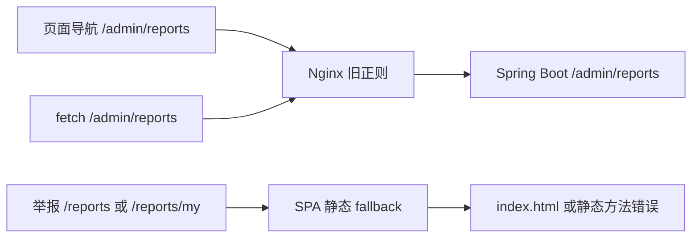
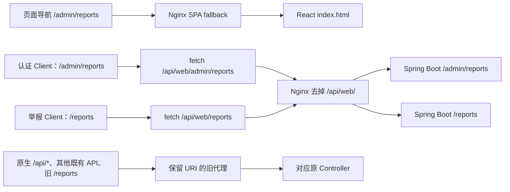

# Portra P0 部署路由故障修复报告

- 任务：PORTRA P0 staging 路由修复。
- 日期：2026-10-10，Asia/Shanghai。
- 基准与当前 HEAD：`5053152629f484c18a7eea4a123aee50c8eb33fb`。收尾时 `git ls-remote origin refs/heads/main` 确认远端仍为此 SHA。
- 分支：`codex/p0-deployment-routing-fix`。
- 独立 worktree：`C:/Users/LiXiaozhou/.codex/worktrees/p0-deployment-routing-fix/Camera`。
- 结论：**本地路由修复与回归通过；整体 CONDITIONAL，staging 发布、真实浏览器人工验收及线上数据库检查为 BLOCKED。**
- 未提交、未推送、未合并、未创建 PR、未触发部署；未修改任何线上配置或数据。

## 1. 故障根因与修复决策

旧 `infra/staging/nginx/portra.conf` 的代理正则包含 `admin`，没有 `reports`：

1. `/reports`、`/reports/my` 落入静态 SPA。此前只读部署核验观察到 GET 返回 HTTP 200、`text/html`；OPTIONS 返回 405 HTML。本轮隔离测试进一步复现 POST 未到原举报 Controller。
2. 浏览器直接导航、刷新 `/admin/reports` 等页面，被转发到 Spring Boot。同一路径还用于管理员数据接口，匿名导航收到业务 code 40101 的 JSON，不能加载 React 页面。
3. 后端原生 API 不只有 `/api/v1/providers`，还包括 `/api/certifications` 和 `/api/admin/certifications`。简单剥离所有 `/api/` 会改错 Controller，甚至在 HTTP 200 / code 200 时拿到错误的列表结构。独立审查发现这个候选问题，真实 HTTP 用例复现 7 项失败；该方案已修正。

最终采用**独立的浏览器 API 命名空间 `/api/web/`**：

- 仅 `temp-staging` 的 `/admin`、`/reports` 路径由原认证 Client 加上 `/api/web`。
- Nginx `location ^~ /api/web/` 使用带尾部斜杠的 `proxy_pass http://127.0.0.1:8080/;`，只移除 `/api/web/`。
- 原生 `/api/*`、其他既有业务 API 保留原路径代理；补入旧举报路径兼容。
- `/admin` 不再属于旧代理正则，交给现有 `try_files` SPA fallback。
- 无基于 Accept、角色、Cookie 或其他请求头的分流；OPTIONS、GET、POST、PATCH 走相同 URL 映射。不增加代理缓存或前端角色授权机制。

认证头、Cookie、请求体的传递沿用现有 fetch 和 Nginx 默认代理行为。登录后的 Refresh Cookie 继续使用 `Path=/auth/refresh`，前端刷新会话仍请求原始 `/auth/refresh`。其 HttpOnly、Secure、SameSite=Lax 属性保持不变。后端身份、活跃会话、管理员权限校验不变；没有修改 Controller 路径。

## 2. 浏览器到服务的路径映射

旧映射：



新映射：



| 用途 | 修复前浏览器 URL | 修复后浏览器 URL | Spring Boot / 静态目标 |
| --- | --- | --- | --- |
| 管理员七个页面 | /admin 及 hall/feed/users/reports/certifications/complaints | 相同页面 URL | React index.html |
| 管理员举报列表/详情/处理 | /admin/reports 及子路径 | /api/web/admin/reports 及子路径 | /admin/reports 及子路径 |
| 管理员登录 | /admin/login | /api/web/admin/login | /admin/login |
| 举报提交 | /reports | /api/web/reports | /reports |
| 本人举报列表 | /reports/my | /api/web/reports/my | /reports/my |
| 旧举报客户端兼容 | /reports、/reports/my | 保留 | 原举报 Controller |
| 原生认证 API | /api/certifications、/api/admin/certifications | 保留 | 完整保留原生 /api URI |
| 原生摄影师 API | /api/v1/providers/* | 保留 | 完整保留原生 /api/v1 URI |
| 认证刷新、退出、会话 | /auth/* | 保留 | /auth/* |
| 普通业务和文件 API | 原始路径 | 保留 | 原 Controller |

`/admin/reports` 在 `frontend/src/routes.jsx` 中是页面；`adminApi.listReports` 仍向 request 传该控制器路径，由 Client 在 staging 中转换成 `/api/web/admin/reports`。没有新增重复的后端 API。

## 3. API Client 和其他模块影响审计

已读取所需的 client.js、reportApi.js、adminApi.js、routes.jsx、staging Nginx 及部署加载代码，并审查 Portra API 模块的 request 调用以及独立二进制下载。

| 模块 | 路径审计结果 |
| --- | --- |
| 举报 | create 的 /reports 加浏览器前缀；原 body、Bearer、credentials: include、会话错误 flags 不变 |
| 管理员 | dashboard、hall-items、moments、users、reports、certifications、review-complaints 的全部 GET/PATCH 路径统一由 Client 添加前缀 |
| 管理员登录 | authApi 的 /admin/login 添加前缀，Cookie 属性和 /auth/refresh 路径不变 |
| 认证与普通用户 | /auth/*、/users/* 不变 |
| 需求与橱窗 | /demands/*、/service-packages/*、/me/service-package-interests 不变 |
| 消息与会话 | /conversations/* 及消息子路径不变 |
| 订单、报价、支付、交付、授权 | /orders/*、/quotations/*、/payments/*、photo-authorizations 相关请求不变 |
| 动态、评价、通知、信用 | /moments/*、/reviews/*、/notifications/*、用户信用相关路径不变 |
| 文件上传/图片二进制 | API_BASE 不变；fileApi /files 上传、fileBinary 的 URL 拼接和 Bearer 不变 |
| 原生认证、provider API | 保留 /api/*；不会被再次添加浏览器前缀 |
| development / production Client | 沿用既有 API_BASE，未更改请求映射或环境配置 |

`API_BASE` 对 temp-staging 仍为空，由同源 Nginx 处理；因此 fileBinary 不会意外迁移路径。Profile 页面独立的外部位置查询未改动。没有新增依赖或修改 lockfile。

其他普通用户页面（例如 /users、/demands 详情）与 API 的历史 URL 重叠未扩大修复；本轮保留其旧行为及业务 API 兼容性。这里不声称已完成全站页面刷新架构改造。

## 4. Git 差异与安全边界

已执行 git status --short、branch --show-current、rev-parse HEAD、diff --stat、diff --check、diff --name-status、diff --cached --stat、ls-files --others --exclude-standard，并独立审查未跟踪新增文件。暂存区为空，diff --check 通过。

| 文件 | 状态 | 变更原因 |
| --- | --- | --- |
| frontend/src/api/client.js | 修改 | staging 管理员/举报请求添加 /api/web 前缀 |
| frontend/package.json | 修改 | 将新增路由回归纳入 npm test |
| infra/staging/nginx/portra.conf | 修改 | 独立浏览器代理、SPA 管理页面、补举报及保留原生接口 |
| infra/staging/scripts/deploy-infra-root.sh | 修改 | 仅更新 Nginx 配置完整字节批准哈希 |
| frontend/tests/stagingRouting.test.mjs | 新增 | 三种模式的路径、认证头、credentials、POST body 与 PATCH 契约 |
| backend/src/test/java/com/action/camera/support/StagingRoutingHttpCheck.java | 新增 | 显式本地运行的真实 Nginx/Spring Boot/H2 HTTP 验收工具 |
| docs/governance/P0_DEPLOYMENT_ROUTING_FIX.md | 新增 | 本报告 |

后端生产 Java、业务逻辑、认证代码、数据库迁移、CI、systemd、sudoers 未改。未加入生产调试代码、真实密码/Token/Cookie/密钥。测试账号仅创建于独立内存 H2，随机密码和真实会话材料只留在 Java 进程内存。记录的 HTTP 证据只有方法、路径、HTTP status、Content-Type、business code 与 passed。

原工作区 `C:/Users/LiXiaozhou/Camera` 仍为 main / `414339e89b9357f986390f33d5a72fb2b2c38985`，仍保留原有 CreditDetailPage、ReviewDetailPage、ReviewPage 未提交修改及原未跟踪目录；本轮所有写入在独立修复 worktree。旧举报 worktree 的未提交报告与预览未操作。

## 5. Nginx 配置与部署加载验证

加载链：`infra/staging/nginx/portra-ssl.conf` 的 HTTPS server include `/etc/nginx/default.d/portra.conf`。受信任 root helper 从固定仓库的新鲜 main 导出配置，核对完整字节 SHA-256，执行 nginx -t 后才安装。普通 deploy 用户不能绕过该边界。

最终 Nginx Git LF 字节 SHA-256：

```text
4d1f7272dec1fe56ae16d77f1015e6cfe549ede3c83a4054b9c9cf80fc8fe9ea
```

Windows core.autocrlf=true 使候选文件末尾一个 CRLF 曾造成批准哈希与 Git 字节不一致。已统一候选为 LF，并用临时 Git 规范字节导出验证，未改全局 Git 配置或其他负责人文件。

| 验证 | 实际结果 |
| --- | --- |
| 真实 nginx -t -p <isolated-prefix> -c nginx.conf | 通过 |
| validate-repository-infra.sh，隔离规范字节导出 | REPOSITORY_INFRA_VALIDATION=PASS，退出码 0 |
| 同一测试导出配置加入未批准注释 | 明确报 portra.conf hash mismatch，退出码 1；随后恢复测试副本 |
| SSL、systemd 原批准哈希 | 保持不变并通过仓库校验 |
| 新代理路由 HTTP 行为 | 101 项通过 |

测试 Nginx 配置只将 canonical portra.conf 的本地后端端口和静态目录替换为隔离测试路径，不改 location、URI 改写、代理头、超时和大小限制。未加载服务器真实 TLS 私钥或修改系统 Nginx。本地 Windows Nginx 验证不等同于 staging Linux nginx -t、实际证书与线上加载结果；后者为 BLOCKED。

官方便携 Nginx 1.31.6 仅解压于 target/routing-audit，未安装服务。ZIP SHA-256：bb65edcfc22a2214a4afaac59f038f560c02b98d4b49c5dca1206d3cc5d631c9。官方资料：[Windows 使用说明](https://nginx.org/en/docs/windows.html)、[proxy_pass](https://nginx.org/en/docs/http/ngx_http_proxy_module.html#proxy_pass)。

## 6. 前后端回归结果与复现命令

最终验证环境：Windows / PowerShell，Oracle JDK 17.0.12，Maven 3.9.16，Node 24.15.0，Nginx 1.31.6；HTTP 夹具启动真实独立 Spring Boot，绑定 127.0.0.1 随机端口，强制使用唯一内存 H2 2.3.232（MySQL mode）及 create-drop。测试结束关闭 Spring/Nginx，未连接 MySQL 或线上服务。

| 命令/检查 | 最终结果 | 日志/报告（除注明完整路径外，位于 backend/target/routing-audit/） |
| --- | --- | --- |
| npm test --prefix frontend | 93 通过、0 失败、0 跳过 | frontend-final-test.log |
| npm run lint --prefix frontend | 退出码 0，0 errors、38 warnings | frontend-final-lint.log |
| npm run build --prefix frontend | 退出码 0 | frontend-production-build.log |
| npm run build:temp-staging --prefix frontend | 退出码 0 | frontend-staging-build.log |
| mvn -B verify（backend） | 756 项，754 通过、0 failure、0 error、2 既有 skipped；coverage gate 通过 | backend-final-verify.log、backend/target/surefire-reports/ |
| 真实 Nginx/Spring HTTP 工具 | 101 项全部通过 | nginx-http-green.log、nginx-http-evidence.json |
| Nginx 语法 | 通过 | nginx-process.log |
| 仓库 infra 正/负验证 | 正例 0、负例预期 1 | infra-validation.log、infra-hash-negative.log |
| 计数汇总 | 与独立日志/XML 一致 | final-summary.json |

完整后端 verify 最终完成于 2026-10-10 16:49:04 +08:00；最终 HTTP 检查完成于 16:52:56 +08:00。lint 与构建的大包警告未在本轮无关修整。未删除、屏蔽或新增跳过条件。

两个既有 MySQL A2 环境测试的 skipped 名称：

- ServicePackageA2MySqlSmokeTest.recommendationUsesFixedSevenSqlStatementsForAllFrozenCandidates
- ServicePackageA2MySqlSmokeTest.sameA1RequestUsesFixedEightSqlStatementsAgainstFrozenMySqlDataset

Windows Java 回环兼容参数仅设置在验证进程，指向较长的任务临时目录，未修改共享配置：

```powershell
# 在修复 worktree/backend 中；该目录位于独立 worktree 长路径下。
New-Item -ItemType Directory -Force target/routing-audit/javatmp | Out-Null
$routingTemp = (Resolve-Path target/routing-audit/javatmp).Path
$env:JAVA_TOOL_OPTIONS = '-Djdk.net.unixdomain.tmpdir=' + $routingTemp
mvn -B verify
```

没有把旧 simple HTTP client 的 PATCH/CORS 限制解释成通过；本轮全量 verify 使用项目默认客户端。

HTTP 检查需**显式执行**，不是 Maven 那 756 项中的新增 JUnit 测试。前置为 staging build、test-compile、生成已有依赖 classpath；无新依赖：

```powershell
# 在修复 worktree/backend 中；NGINX_BIN 为官方便携 nginx.exe 的绝对路径。
mvn -B test-compile dependency:build-classpath '-Dmdep.outputFile=target/routing-audit/classpath.txt'
$routingClasspath = 'target/test-classes;target/classes;' + (Get-Content target/routing-audit/classpath.txt -Raw).Trim()
$routingTemp = (Resolve-Path target/routing-audit/javatmp).Path
java "-Djdk.net.unixdomain.tmpdir=$routingTemp" -cp $routingClasspath com.action.camera.support.StagingRoutingHttpCheck $env:NGINX_BIN ((Resolve-Path ..).Path)
```

失败到通过证据：旧 Client 的新增模式用例因 /reports 与 /api/reports 不符而失败；旧 Nginx 出现 HTML/JSON 错配与 OPTIONS 405（nginx-http-red-evidence.json）；剥离所有 /api 的中间候选被 native-regression 用例检出 7 项失败。最终 /api/web 方案、原生认证响应结构保护和 LF 哈希均已验证通过。中间候选日志仅作为失败证据，不是当前交付版本。

## 7. 实际 HTTP 路由验证范围

| 项目 | 实际验证 | 结果 |
| --- | --- | --- |
| 七个管理员页面及 /admin/users/42 | 每页两次 GET（HTML Accept、no-cache），响应与本次真实 dist/index.html 一致 | HTTP 200 / text/html |
| 构建静态资源 | 按 index 引用访问 CSS/JS，拒绝把 index fallback 当资源成功 | 通过 |
| 原始与前缀举报匿名请求 | POST /reports、/api/web/reports；GET /reports/my、/api/web/reports/my | HTTP 200 / application/json / code 40101 |
| 七类管理员 GET | dashboard、hall-items、moments、users、reports、certifications、review-complaints | 匿名 40101、普通用户 40301、管理员 200 |
| 三类举报 | DEMAND、SERVICE_PACKAGE、USER →真实 POST→真实 GET详情→普通用户越权 PATCH→管理员 IGNORE PATCH | 成功 code 200；越权 40301；数据库 target/type/status 与请求一致 |
| 旧举报路径兼容 | 合法 POST /reports、GET /reports/my | JSON / code 200 |
| 原生认证接口 | 当前认证不存在、提交缺字段、管理员分页列表、普通用户越权、审批不存在对象 | 40401/40001/200/40301；分页 records 结构不混为旧管理列表 |
| 原生 /api/v1 provider | 没有建立 provider profile 的合法测试对象 | 正确 JSON / code 40401，而非错路由或 HTML |
| 普通业务代表路径 | 需求/橱窗列表与详情、用户资料、订单、通知、会话、评价投诉、橱窗兴趣 | JSON / code 200 |
| OPTIONS | 6 个举报/管理/认证路径 × GET/POST/PATCH | HTTP 200、origin/credentials/allow-method/header 正确 |
| 管理员登录与会话刷新 | 原登录 Controller，经代理拿 Cookie；校验 Cookie 安全属性并手动重放给 /auth/refresh | code 200，路径与头正常传递 |

所有匿名/越权结果按原后端业务 envelope 判断；HTTP 200 并不表示授权成功。没有用 MockMvc 或伪造 HTTP 成功响应代替这些代理验收。前端模式用例中的 fetch 替身仅证明 Client 构造 URL/headers/body，其成功返回不作为服务器联调证据。

边界：两次页面 HTTP GET 证明直接访问/刷新可取得正确 SPA 文档，不等同于已登录真实浏览器执行 React 后的完整视觉与交互验收；Cookie 手动重放不证明浏览器 HTTPS Cookie 自动存储。上述浏览器人工验收仍待 staging 单独授权和合法测试账号。

## 8. 独立审查与剩余风险

独立只读审查已检查 Client、Controller 原生路径、Nginx、Cookie、文件 URL、helper trust chain 及部署顺序。此前审查指出的原生认证冲突已修正，并增加真实失败/通过证据。最终独立只读复核未发现阻止本地验收或人工代码审查的缺陷；最终报告亦经复核，无实质遗漏。线上发布仍需满足下节操作前提。

| 分级 | 风险/状态 | 证据与处理 |
| --- | --- | --- |
| 线上验收阻塞 | staging 尚未发布本修复；线上实际业务未完成验收 | 本轮无部署授权；本地通过不能替代线上可用性。未发现新的后端权限绕过缺陷 |
| P1（部署操作前提） | 前端与 Nginx 混合版本窗口会使管理员请求失败 | deploy.yml 先切应用后更新 Nginx；health-check 仅检查普通列表/root/auth-refresh，不能发现管理功能回归 |
| P1（已修复） | 泛 /api 剥离破坏原生认证 Controller/响应结构 | 原生 HTTP 用例曾检出 7 项失败；最终保留原 URI |
| P1（已修复） | CRLF EOF 导致批准哈希与 Git LF 不一致 | 最终规范字节 infra 正例通过，篡改负例拒绝 |
| P2 | 既有 lint 与 chunk warnings、其他普通页面/API 历史重叠 | 无新增依赖或页面重构；不扩大本轮职责 |

本轮不声称全站端到端验收全部通过。剩余环境/操作条件不伪装成测试通过。

## 9. staging 发布、数据库检查与人工验收条件

| 待办 | 当前状态 | 未验证原因 |
| --- | --- | --- |
| 发布修复至 staging、核验部署 SHA 与实际 nginx -t | BLOCKED | 未取得单独部署授权，未提交 SHA |
| 已部署七个管理页面的真实浏览器直接访问与刷新 | BLOCKED | 当前线上不是修复版本 |
| 已部署管理员合法请求、普通用户越权与举报表单交互 | BLOCKED | 未提供获授权的测试会话，隔离条件未确认 |
| reports、audit_records、active_dedupe_key 与唯一索引 | BLOCKED | 未获授权的只读数据库连接，实际 MySQL 版本和结构未知 |
| 已部署举报提交、处罚、恢复 | BLOCKED | 未确认与生产数据隔离；本轮没有任何线上写入 |

**安全发布准备（仅说明，未执行）：**

1. 完成人工代码审查，明确授权提交/推送/合并及单独 staging 发布。此处的代码可审查结论不是操作授权。
2. 审核并按 infra/staging/README.md 的受信任 main bootstrap 流程更新 root-owned helper 与 bootstrap marker。helper 本轮只变 Nginx 批准哈希，但旧安装版本会拒绝新配置；不改 sudoers，也不绕过 checksum/当前 main 检查。
3. 安排前端与 Nginx 协调切换及**成对回滚**。现有 workflow 不是跨两者原子部署；默认健康检查不足以验收修复，不建议未经操作安排直接执行 auto 部署。保留旧 Nginx 配置及旧前后端发布标识，失败时按已审查方案恢复相同兼容组合；旧浏览器标签需刷新。CI/部署顺序改造需另行授权，本轮未改。
4. 发布后读取部署 provenance、deployment.json、实际代理响应，核验目标 SHA；逐一复查管理七页面、举报 GET/POST/PATCH/OPTIONS 的类型、业务 code、角色权限及 Cookie 行为。
5. 确认测试环境与生产隔离后，使用获授权的测试账号及合法只读 DB 权限检查表结构、active_dedupe_key nullable 定义、唯一索引真实存在；输出 schema/索引摘要而非令牌、密码、连接凭据或用户资料。
6. 只有确认隔离和写入授权后，才做测试举报/管理员处罚/恢复的线上闭环。H2 不替代 MySQL 契约或并发验收，数据库迁移和数据修复不在本轮范围。

## 10. 最终交付判断

- 本地路由修复、语法验证、前端全套测试/两种构建、后端完整 verify、真实 HTTP 与 infra 白名单验证：**通过**。
- 可提交人工代码合并审核：**可以，需附本报告并明确部署 bootstrap/切换前提；本轮无操作授权，不执行提交或合并。**
- 当前直接发布或认定 staging 正常可用：**不具备条件**；必须独立授权、协调部署并完成真实浏览器/数据库验收。
- 总体状态：**CONDITIONAL**；staging 强制后续验证项为 BLOCKED，不能标记线上 PASS。
- 没有开发 P0-E 或订单争议工作台。完成报告后停止。
